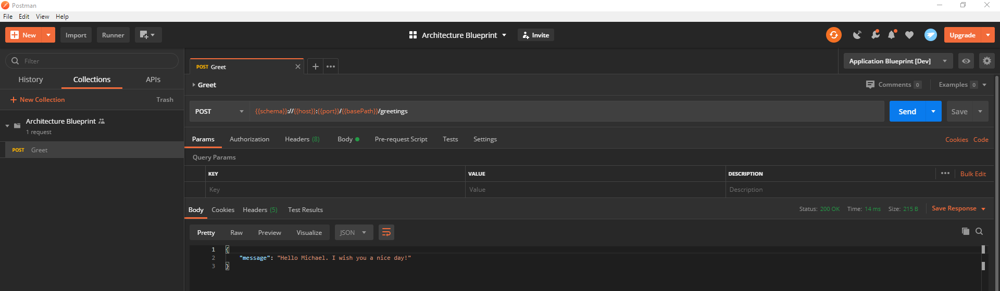

# Architecture Blueprint

An "Hello World" project for a SOLID and DDD oriented application architecture. 

## How to run

1. Run `./mvnw clean install` within the project directory.
1. Start the service by running `./mvnw spring-boot:run -pl architecture-blueprint-infrastructure`

Alternatively simply run the main method within the `ArchitectureBlueprintApplication` class from your IDE.

For running in a Kubernetes cluster, a readiness probe is exposed via `/actuator/health/readiness` and 
liveness probe via `/actuator/health/liveness`.

## How to use

1. Download and install [postman](https://www.postman.com/) if not already installed.
1. Import the collection and environment from the directory `postman` by clicking on `File -> Import... -> Import Folder -> Choose Folders`. 
Navigate to the `postman` directory of this project and choose it.
1. Select the imported environment in the top right corner via the drop down menu next to the eye icon.
1. Select the request `Greet` within the postman collection (left hand side) and click `Send`.

 

## Hint

When building the project, maven will generate an interface and some DTOs out of a swagger file. 
The generated files will be generate to the target directory. Make sure IntelliJ detected the generated
classes correctly ans includes the directory in the classpath. If not, navigate to `target/generated-sources/openapi/src/main/generated`.
Right click on the directory `generated`, navigate to the menu item `Mark Directy as` and choose `Generated Sources Root`. 
Afterwards IntelliJ should include the directy in the classpath and the imports should work.